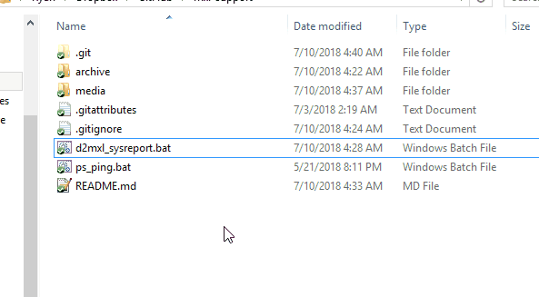
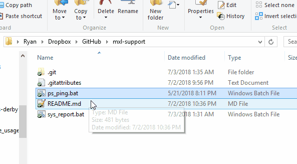

# MedianXL SupportTools
## Helpful utilities during Median XL troubleshooting

General feedback and discussion is facilitated at the [Median XL forum thread](http://forum.median-xl.com/viewtopic.php?p=188053).

[d2mxl_sysreport.bat](#d2mxl_sysreport.bat)  
[ps_ping.bat.bat](#ps_ping.bat)

### d2mxl_sysreport.bat
Reports various D2 and OS settings.

##### Script Activities
* Installation Path (Registry)
* patch_d2.mpq Version (MD5 via CertUtil: win7+)
* D2 DEP Settings (Registry)
* D2 Root File List

##### Example

### ps_ping.bat
Offers a textual menu interface for pinging network connections associated with running programs.

##### Script Activities
* Select Process
* Select Network Connection
* Ping target IP

##### Example

